# Análise e Predição de Preços de Imóveis em São Paulo

Projeto de Ciência de Dados voltado à análise do mercado imobiliário da cidade de São Paulo, utilizando técnicas de análise exploratória, estatística e aprendizado de máquina para compreender os fatores associados aos preços de venda e aluguel de imóveis.

[English Version Here](English.md)

---

## 📌 Objetivo

Investigar os principais fatores que influenciam os preços dos imóveis e desenvolver um modelo capaz de estimar valores a partir de características estruturais e locacionais.

As principais questões analisadas foram:

* Quais características mais impactam o preço dos imóveis?
* Como a localização influencia os valores de venda e aluguel?
* Existe relação entre área, infraestrutura e preço?
* É possível prever o valor de um imóvel utilizando técnicas estatísticas e de Machine Learning?

---

## 📊 Dataset

A base utilizada contém informações sobre imóveis residenciais da cidade de São Paulo, incluindo características físicas, localização e custos associados.

### Principais variáveis

| Variável  | Descrição           |
| --------- | ------------------- |
| Price     | Preço do imóvel     |
| District  | Distrito/Bairro     |
| Size      | Área do imóvel      |
| Rooms     | Número de quartos   |
| Toilets   | Número de banheiros |
| Suites    | Número de suítes    |
| Parking   | Número de vagas     |
| Condo     | Valor do condomínio |
| Elevator  | Possui elevador     |
| Furnished | Imóvel mobiliado    |

---

## 🛠 Tecnologias Utilizadas

* Python
* Pandas
* NumPy
* Matplotlib
* Seaborn
* Scikit-Learn
* Statsmodels

---

## 🔎 Etapas do Projeto

### 1. Tratamento dos Dados

* Importação da base de dados
* Limpeza e padronização
* Tratamento de valores ausentes
* Conversão de variáveis categóricas

### 2. Análise Exploratória dos Dados (EDA)

Foram realizadas análises para compreender a distribuição dos preços e identificar padrões relevantes.

Principais análises:

* Distribuição dos preços de venda e aluguel
* Comparação entre bairros
* Relação entre área e preço
* Avaliação das características dos imóveis
* Identificação de possíveis outliers

### 3. Análise Estatística

Foram investigadas relações entre variáveis utilizando medidas estatísticas e correlações.

Incluindo:

* Correlação entre variáveis numéricas
* Associação entre variáveis categóricas
* Interpretação dos fatores mais relevantes

### 4. Modelagem Preditiva

Foi desenvolvido um modelo de regressão linear para estimar preços de imóveis.

Etapas:

* Separação em treino e teste
* Treinamento do modelo
* Avaliação por métricas de desempenho
* Comparação entre valores reais e previstos

---

## 📈 Principais Insights

### 🏠 O mercado de locação e o mercado de venda apresentam comportamentos distintos

Apesar de analisarem os mesmos imóveis, os rankings de valorização variam entre aluguel e venda, indicando que fatores que impulsionam preços de locação nem sempre impactam os preços de venda da mesma forma.

### 📍 Os distritos mais valorizados concentram-se em regiões nobres da cidade

Nos imóveis para locação, bairros como Itaim Bibi, Iguatemi e Alto de Pinheiros apresentaram os maiores valores médios de aluguel.

Nos imóveis para venda, Iguatemi, Alto de Pinheiros, Itaim Bibi, Jardim Paulista e Moema concentraram os maiores preços médios de mercado também.

### 💰 A desigualdade de preços entre distritos é expressiva

Os menores preços médios foram observados em distritos periféricos como Itaim Paulista, Grajaú e Lajeado para locação, enquanto Cidade Tiradentes, Lajeado, Artur Alvim, Guaianases e Perus apresentaram os menores valores médios de venda. 

### 📊 A base apresenta equilíbrio entre imóveis para venda e locação

Os imóveis destinados à locação representam aproximadamente 53% da base, enquanto os destinados à venda representam cerca de 47%, permitindo análises comparativas entre os dois mercados.

### 📐 Área construída influencia diretamente o valor

Imóveis com maior metragem apresentam tendência de preços mais elevados no mercado de venda, mas não representa tanta significância no mercado de locação.

### 🚗 Infraestrutura agrega valor

Características como vagas de garagem, número de suítes e banheiros estão associadas a imóveis mais valorizados.

### 🏢 Condomínio é um indicador relevante

Valores de condomínio mais altos geralmente estão associados a imóveis de padrão superior. Importante destacar apesar da correlação alta, não indica causalidade.

### 🤖 Modelagem estatística permitiu estimar preços a partir das características dos imóveis

A utilização de regressão linear possibilitou avaliar a influência conjunta das variáveis do imóvel e construir um modelo preditivo para estimativa de preços de venda.

---

## 📊Visualizações

### Distribuição dos preços

#### Aluguel
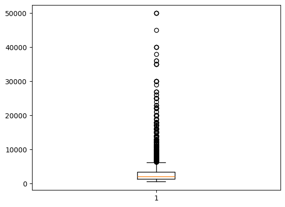

#### Venda
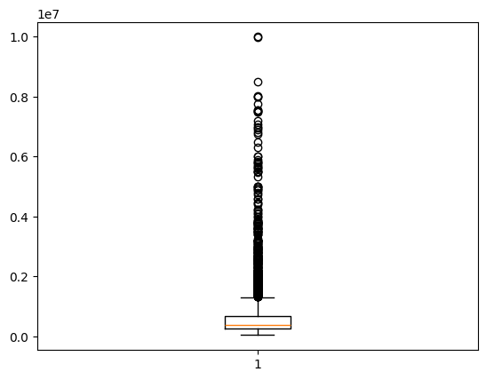

### Bairros mais caros e mais baratos

#### Aluguel
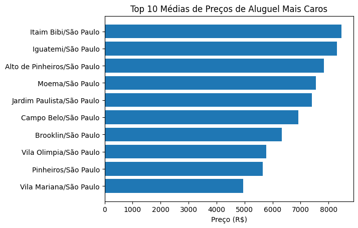

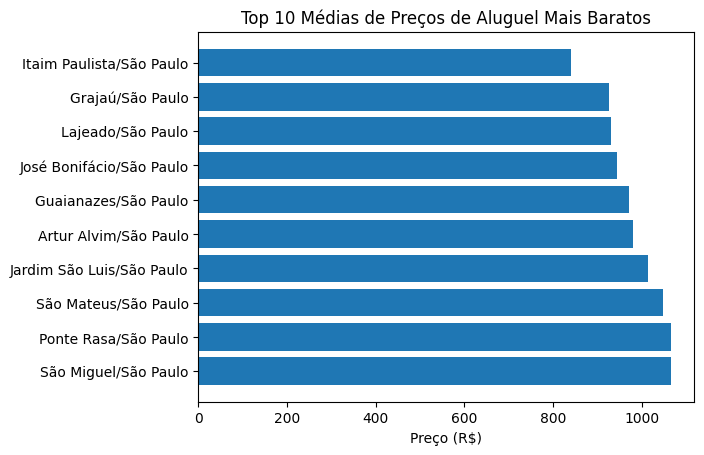

#### Venda
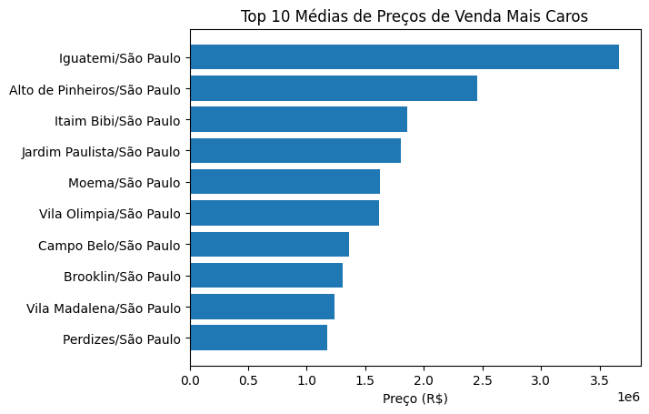

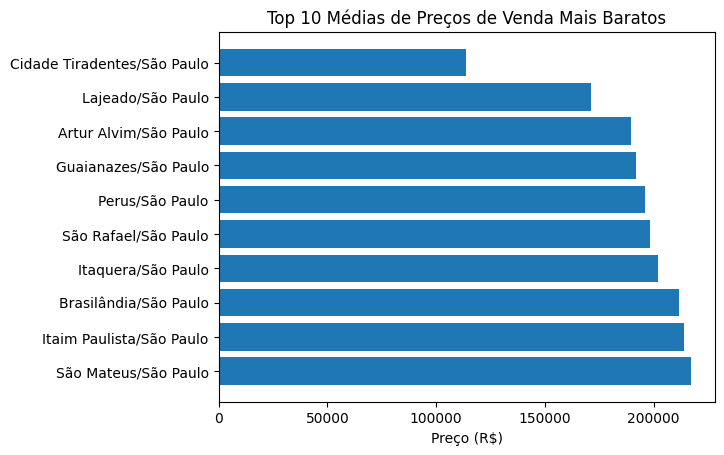

### Área x Preço
#### Aluguel
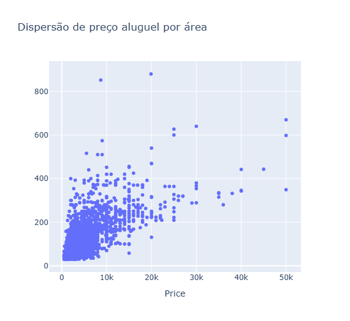


#### Venda
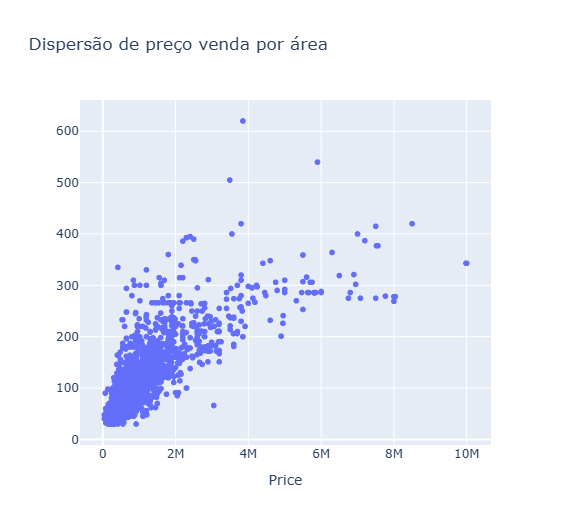


### Matriz de Correlação

#### Aluguel
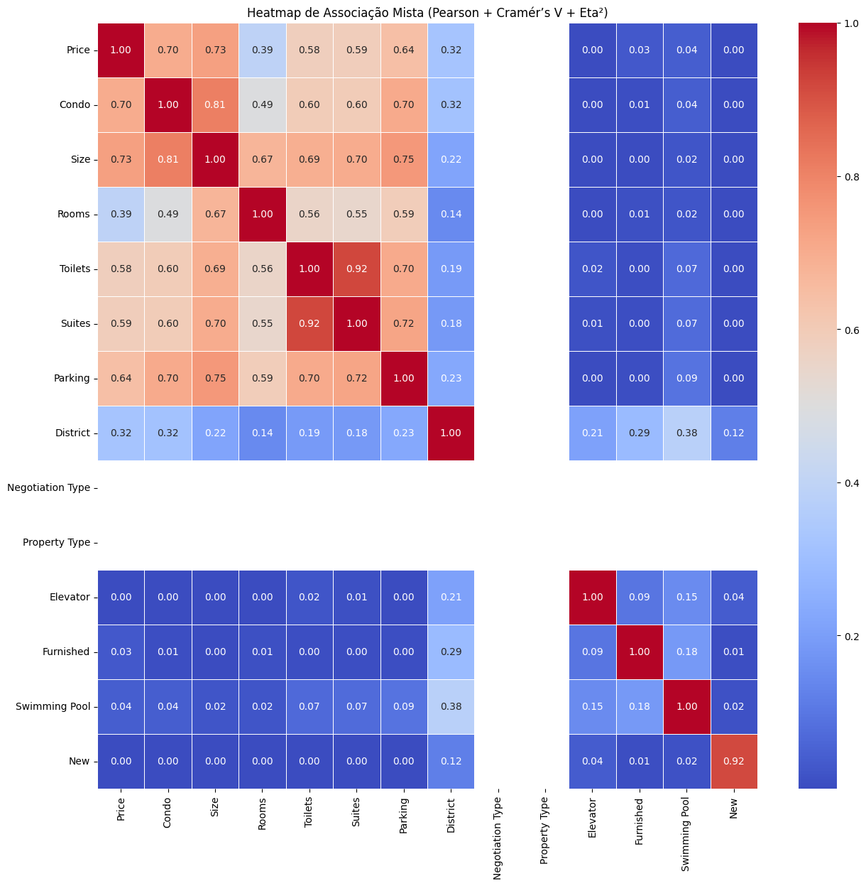

#### Venda
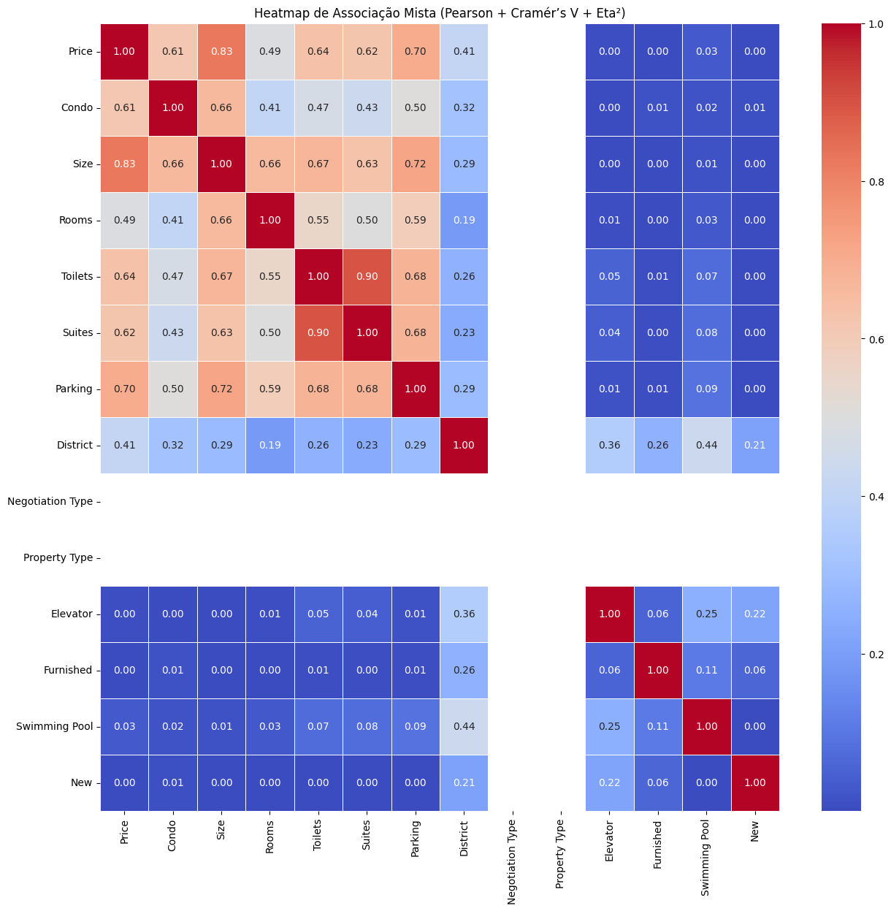


### Real x Previsto
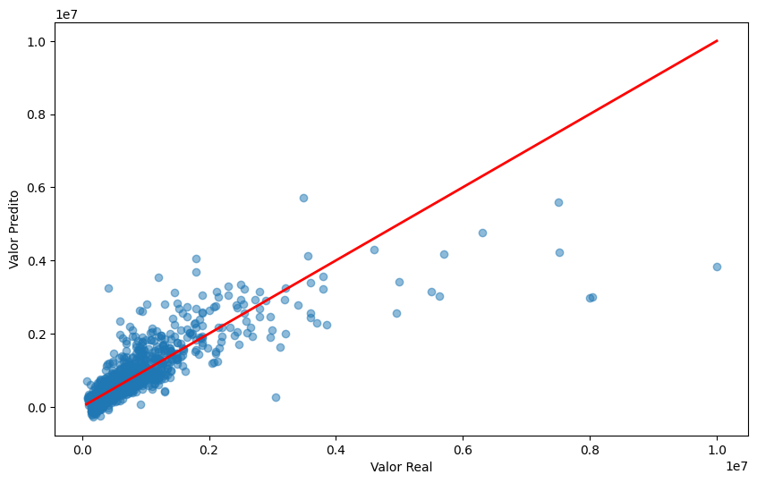


---

## 📂 Estrutura do Projeto

```text
📁 analise-vendas-sp
│
├── img/
├── notebooks/
│   └── analise_imoveis.ipynb
│
├── README.md
```

---

## 📌 Conclusão

O projeto demonstrou como técnicas de análise exploratória, estatística e Machine Learning podem ser aplicadas para compreender o mercado imobiliário e identificar fatores que influenciam a formação de preços dos imóveis.

Além de fornecer insights relevantes sobre localização, infraestrutura e valorização, a análise mostrou que modelos preditivos podem auxiliar na estimativa de preços e apoiar processos de tomada de decisão no setor imobiliário.

---

## 👩‍💻 Autora

**Ana Luisa Rodrigues**

Estudante de Engenharia de Computação | Python | Estatística | Machine Learning | Visualização de Dados
